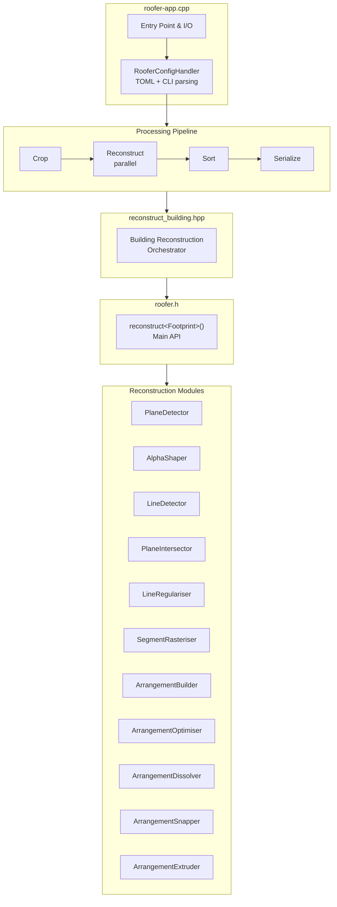
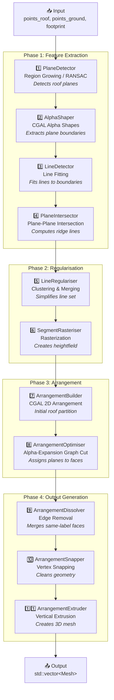

# AGENTS.md - Roofer Codebase Guide

This document provides a comprehensive overview of the **roofer** codebase for AI coding assistants. Roofer is an automatic 3D building reconstruction tool that generates LoD 1.2, 1.3, and 2.2 building models from LiDAR point clouds and 2D building footprints.

> **Note**: Use the Serena MCP tools (`mcp_serena_list_dir`, `mcp_serena_find_symbol`, etc.) to explore the directory structure and navigate the codebase.
>
> **Build**: After making changes, verify the build with `cmake --build build` to ensure compilation succeeds.

---

## Table of Contents

1. [Project Overview](#project-overview)
2. [Architecture](#architecture)
3. [Reconstruction Algorithm Pipeline](#reconstruction-algorithm-pipeline)
4. [Key Parameters for LoD2.2](#key-parameters-for-lod22)
5. [Algorithm Deep Dive](#algorithm-deep-dive)
6. [CGAL Components Used](#cgal-components-used)
7. [Extension Points](#extension-points)

---

## Project Overview

**Roofer** performs fully automatic LoD2 building reconstruction from:

- **Input**: Classified LiDAR point cloud (LAS/LAZ) + building footprint polygons
- **Output**: CityJSONSequence files containing 3D building models

### Key Assumptions

- Roof shapes are **piecewise planar** (approximated with planar faces)
- Building models are **2.5D** with vertical walls (no roof overhangs/balconies)
- Point clouds and footprints are **properly aligned** in the same CRS
- Point clouds are **classified** (at least building and terrain classes)

---

## Architecture



### Key Source Locations

| Component                 | Location                                   |
| ------------------------- | ------------------------------------------ |
| Main API                  | `include/roofer/roofer.h`                  |
| Configuration             | `apps/roofer-app/config.hpp`               |
| Building Orchestrator     | `apps/roofer-app/reconstruct_building.hpp` |
| Algorithm Interfaces      | `include/roofer/reconstruction/*.hpp`      |
| Algorithm Implementations | `src/core/reconstruction/*.cpp`            |

---

## Reconstruction Algorithm Pipeline



---

## Key Parameters for LoD2.2

These parameters directly affect the quality and detail of LoD2.2 reconstruction results:

### Plane Detection

| Parameter                   | CLI Flag                    | Default | Effect                                                                                                      |
| --------------------------- | --------------------------- | ------- | ----------------------------------------------------------------------------------------------------------- |
| `plane_detect_k`            | `--plane-detect-k`          | 15      | Neighbors for region growing. ↑ = better connectivity in sparse areas, slower. ↓ = faster, may miss planes. |
| `plane_detect_min_points`   | `--plane-detect-min-points` | 15      | Minimum points per plane. ↑ = ignores small features. ↓ = more sensitive to noise.                          |
| `plane_detect_epsilon`      | `--plane-detect-epsilon`    | 0.3m    | Max point-to-plane distance. ↑ = robust, fewer planes. ↓ = more planes, risk of over-segmentation.          |
| `plane_detect_normal_angle` | N/A                         | 0.75    | Normal similarity threshold (dot product). ↑→1.0 = stricter segmentation.                                   |

### Boundary & Line Extraction

| Parameter             | Default | Effect                                                                             |
| --------------------- | ------- | ---------------------------------------------------------------------------------- |
| `thres_alpha`         | 0.25m   | Alpha shape parameter. ↑ = smoother boundaries. ↓ = more detailed, noisier.        |
| `line_detect_epsilon` | 1.0m    | Line fitting tolerance. ↑ = straighter lines. ↓ = follows points closely.          |
| `thres_reg_line_dist` | 0.8m    | Distance for merging parallel lines. ↑ = simpler models. ↓ = preserves detail.     |
| `thres_reg_line_ext`  | 3.0m    | Line extension before arrangement. ↑ = better coverage. ↓ = safer, may miss edges. |

### Graph-Cut Optimization

| Parameter           | CLI Flag              | Default | Effect                                                                                                                      |
| ------------------- | --------------------- | ------- | --------------------------------------------------------------------------------------------------------------------------- |
| `complexity_factor` | `--complexity-factor` | 0.7     | **Most important parameter.** λ in energy function. ↑→1.0 = detailed models (data-driven). ↓→0.0 = simpler models (smooth). |
| `clip_ground`       | `--clip-ground`       | true    | Clips footprint where ground detected. true = realistic but may be irregular.                                               |

### Graph-Cut Energy Function

```
E(f) = λ·Σ D_p(f_p) + (1-λ)·Σ S_{p,q}(f_p, f_q)

Where:
  D_p = Data term: volume between face and assigned plane
  S_{p,q} = Smoothness term: shared edge length
  λ = complexity_factor
```

---

## Algorithm Deep Dive

### 1. Plane Detection (PlaneDetector.cpp)

**Method**: Region Growing with optional RANSAC fallback

**CGAL Components**:

- `CGAL::Shape_detection::Region_growing`
- `CGAL::pca_estimate_normals` - PCA-based normal estimation

**Algorithm**:

1. Estimate normals via PCA on k-nearest neighbors
2. Orient normals upward
3. Region growing from seed points:
   - Add neighbors if: distance to plane < epsilon AND normal angle < threshold
   - Update plane fit with each addition
4. Store regions with >= min_points as detected planes
5. Compute plane adjacencies using k-NN

### 2. Alpha Shapes (AlphaShaper.cpp)

**Method**: 2D Alpha Shapes projected to XY plane

**CGAL Components**:

- `CGAL::Alpha_shape_2`
- `CGAL::Delaunay_triangulation_2`
- `CGAL::Projection_traits_xy_3`

**What Alpha Shapes Do**:

- Generalization of convex hull that captures concave boundaries
- α parameter controls boundary detail: small α = detailed, large α = smooth
- `find_optimal_alpha(1)` finds minimum α for single connected component

**Algorithm**:

1. Build Delaunay triangulation of plane points
2. Construct alpha shape with given α
3. Flood-fill to label: exterior, holes, interior regions
4. Extract boundary rings (CCW exterior, CW holes)

### 3. Graph-Cut Optimization (ArrangementOptimiser.cpp)

**Method**: Alpha-Expansion Graph Cut

**CGAL Components**:

- `CGAL::alpha_expansion_graphcut`

**Algorithm**:

1. **Graph Construction**:

   - Vertices = arrangement faces inside footprint
   - Edges = shared boundaries
   - Labels = detected planes + ground planes

2. **Cost Computation**:

   ```cpp
   // Data term: volume between face heightfield and plane
   for each face, for each plane:
     cost = data_multiplier * cell_area * Σ|height - plane_z|

   // Smoothness term: boundary length
   for each edge:
     weight = smoothness_multiplier * edge_length
   ```

3. **Solve**: Alpha-expansion iteratively improves labeling

4. **Apply**: Each face receives optimal plane assignment

---

## CGAL Components Used

| Component                  | CGAL Module               | Purpose                     |
| -------------------------- | ------------------------- | --------------------------- |
| `Region_growing`           | Shape Detection           | Plane detection             |
| `Efficient_RANSAC`         | Shape Detection           | Alternative plane detection |
| `pca_estimate_normals`     | Point Set Processing      | Normal estimation           |
| `Alpha_shape_2`            | Alpha Shapes 2            | Boundary extraction         |
| `Arrangement_2`            | 2D Arrangements           | Roof partition              |
| `alpha_expansion_graphcut` | Surface Mesh Segmentation | Label optimization          |

---

## Extension Points

### Adding New Plane Detection Methods

1. Implement `PlaneDetectorInterface` in `src/core/reconstruction/`
2. Register factory in header
3. Add config parameters to `RooferConfig`

### Improving Graph-Cut Energy

Modify `ArrangementOptimiser.cpp`:

- `volume_to_plane()` - Data term calculation
- `edge_length()` - Smoothness term
- Add orientation/symmetry constraints

### Custom Line Regularisation

Modify `LineRegulariser.cpp`:

- Alternative clustering strategies
- Orthogonality/parallelism enforcement

### Key Files to Modify

| Task                       | File(s)                                               |
| -------------------------- | ----------------------------------------------------- |
| Add CLI parameter          | `apps/roofer-app/config.hpp`                          |
| Change plane detection     | `src/core/reconstruction/PlaneDetector.cpp`           |
| Change boundary extraction | `src/core/reconstruction/AlphaShaper.cpp`             |
| Change optimization        | `src/core/reconstruction/ArrangementOptimiser.cpp`    |
| Add new LoD                | `ArrangementDissolver.cpp`, `ArrangementExtruder.cpp` |

---

## References

- [Roofer Documentation](https://3dbag.github.io/roofer/)
- [CGAL Manual](https://doc.cgal.org/latest/Manual/)
- [CityJSON Specification](https://www.cityjson.org/)

---
